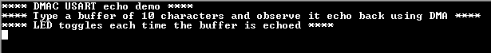

# DMAC USART echo

This example application demonstrates USART transfer with DMA to receive 10 bytes and echo back the received bytes.

## Description

This application demonstrates USART transfer with DMA using SERCOM peripheral configured in USART mode. One DMA channel is used to receive 10 bytes of data from the USART and another DMA channel is used to echo back the received bytes.

## Downloading and building the application

To download or clone this application from Github, go to the [top level of the repository](https://github.com/Microchip-MPLAB-Harmony/csp_apps_sam_l10_l11) and click

Path of the application within the repository is **apps/dmac/dmac_usart_echo/firmware** .

To build the application, refer to the following table and open the project using its IDE.

| Project Name      | Description                                    |
| ----------------- | ---------------------------------------------- |
| sam_l10_xpro.X | MPLABX project for [SAML10 Xplained Pro Evaluation Kit](https://www.microchip.com/DevelopmentTools/ProductDetails/dm320204) |
|||

## Setting up the hardware

The following table shows the target hardware for the application projects.

| Project Name| Board|
|:---------|:---------:|
| sam_l10_xpro.X | [SAML10 Xplained Pro Evaluation Kit](https://www.microchip.com/DevelopmentTools/ProductDetails/dm320204)
|||

### Setting up [SAML10 Xplained Pro Evaluation Kit](https://www.microchip.com/DevelopmentTools/ProductDetails/dm320204)

- Connect the Debug USB port on the board to the computer using a micro USB cable

## Running the Application

1. Open the Terminal application (Ex.:Tera term) on the computer
2. Connect to the EDBG Virtual COM port and configure the serial settings as follows:
    - Baud : 115200
    - Data : 8 Bits
    - Parity : None
    - Stop : 1 Bit
    - Flow Control : None
3. Build and Program the application using its IDE
4. The console displays the following message

    

5. Type 10 characters in the console
6. Entered 10 characters will be echoed back and the LED is toggled
7. The following table provides the LED names

| Board      | LED Name                                    |
| ----------------- | ---------------------------------------------- |
| [SAML10 Xplained Pro Evaluation Kit](https://www.microchip.com/DevelopmentTools/ProductDetails/dm320204) |LED0 |
|||
