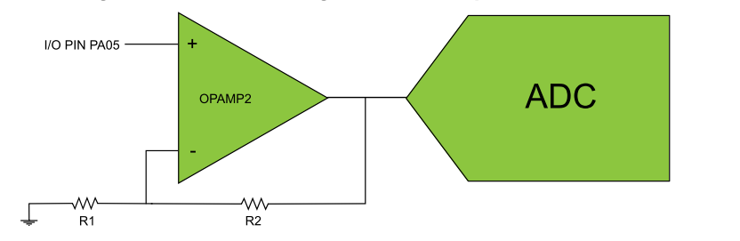
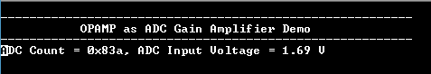

# OPAMP ADC gain

This application shows how OPAMP can be used as gain stage for the internal ADC peripheral.

## Description

In this example application one of the OPAMPs is configured as a Non-Inverting Programmable Gain Amplifier (PGA) with output internally connected to the ADC module for signal sampling. The input signal is connected to the non-inverting (positive) input while the inverting (negative) input and the output is connected in a closed loop with an internal resistor ladder. The OPAMP2 positive input can be multiplexed to I/O pin PA05, hence the input signal to be amplified must be connected to this pin. The pin must also be configured as an input. The ADC input multiplexer needs to be configured (MUXPOS = 0x1F) in order to use the OPAMP2 output as input. In this example OPAMP2 is configured with R2/R1 = 1/3. Thus, the gain for this non-inverting
configuration is 1.33.

  

The ADC is configured as follows:

- Single ended mode
- VDDANA (3.3 V) as reference
- Perform conversion on software trigger
- Generate interrupt when the result is ready

## Downloading and building the application

To download or clone this application from Github, go to the [top level of the repository](https://github.com/Microchip-MPLAB-Harmony/csp_apps_sam_l10_l11) and click

Path of the application within the repository is **apps/opamp/opamp_adc_gain_amp/firmware** .

To build the application, refer to the following table and open the project using its IDE.

| Project Name      | Description                                    |
| ----------------- | ---------------------------------------------- |
| sam_l10_xpro.X | MPLABX project for [SAML10 Xplained Pro Evaluation Kit](https://www.microchip.com/DevelopmentTools/ProductDetails/dm320204) |
|||

## Setting up the hardware

The following table shows the target hardware for the application projects.

| Project Name| Board|
|:---------|:---------:|
| sam_l10_xpro.X | [SAML10 Xplained Pro Evaluation Kit](https://www.microchip.com/DevelopmentTools/ProductDetails/dm320204)
|||

### Setting up [SAML10 Xplained Pro Evaluation Kit](https://www.microchip.com/DevelopmentTools/ProductDetails/dm320204)

- Non-inverting input of OPAMP2 is available on PA05 (Pin 15 on EXT1 connector).
- Connect the input signal to this pin (Since the OPAMP gives gain of 1.33, choose appropriate voltage to be connected at input of the OPAMP so that it does not saturate the ADC result)
- Connect the Debug USB port on the board to the computer using a micro USB cable

## Running the Application

1. Open the Terminal application (Ex.:Tera term) on the computer
2. Connect to the EDBG Virtual COM port and configure the serial settings as follows:
    - Baud : 115200
    - Data : 8 Bits
    - Parity : None
    - Stop : 1 Bit
    - Flow Control : None
3. Build and Program the application using its IDE
4. The console output will be as given below when the voltage at PA05 is 1.27 V
   - The ADC result shows gain ie; output of OPAMP2 = 1.33 * 1.27 V = 1.69 V

    