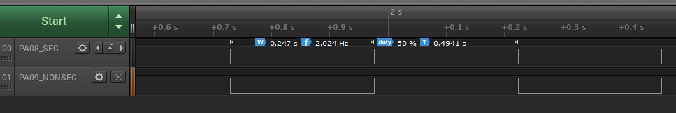

# TrustZone EVSYS trigger

This example application demonstrates peripheral event handling with event system in secure and non-secure project

## Description

This demonstrates TrustZone feature and uses two projects viz., Secure and Non-Secure Project that work together on the same MCU and offering security isolation between the Trusted and the Non-trusted resources in the device.

- Secure project route the events generated by RTC periodic event to toggle a GPIO pin assigned to secure side and a GPIO pin assigned to non-secure side without CPU intervention
= Non secure project route the EIC event to toggle an LED without CPU intervention

## Components Used

- **EIC** - Configured as mix-secure Peripheral for Secure EIC and Non-secure EIC interrupts
- **Event System** - Configured as mix-secure Peripheral for the Secure and Non-secure events
- **RTC** - Configured as secure mode
- **LED** - Configured as non-secure mode
- **SECURE_PIN and NON_SECURE_PIN** - Configured as secure and non-secure mode respectively

## Downloading and building the application

To clone or download this application from Github, go to the [main page of this repository](https://github.com/Microchip-MPLAB-Harmony/csp_apps_sam_l10_l11) and then click **Clone** button to clone this repository or download as zip file.
This content can also be downloaded using content manager by following these [instructions](https://github.com/Microchip-MPLAB-Harmony/contentmanager/wiki).

Path of the application within the repository is is as shown below:

| Type        | Path                         |
|:-----------:|:----------------------------:|
| Project group | apps/trustZone/evsys/evsys_trigger |
|Secure Project|  apps/trustZone/evsys/evsys_trigger/Secure/firmware |
|Non-Secure Project|  apps/trustZone/evsys/evsys_trigger/NonSecure/firmware |
||||

To build the application, refer to the following table and open the project using its IDE.

| Project Name      | Description                                    |
| :-----------------: | :----------------------------------------------: |
| sam_l11_xpro_Secure.X   sam_l11_xpro_NonSecure.X | Secure and Non-secure MPLABX project for [SAML11 Xplained Pro Evaluation Kit](https://www.microchip.com/DevelopmentTools/ProductDetails/PartNO/DM320205) |
|||

## Setting up the hardware

The following table shows the target hardware for the application projects.

| Project Name| Board|
|:---------|:---------:|
| sam_l11_xpro_Secure.X   sam_l11_xpro_NonSecure.X | [SAML11 Xplained Pro Evaluation Kit](https://www.microchip.com/DevelopmentTools/ProductDetails/PartNO/DM320205) |
|||

### Setting up [SAML11 Xplained Pro Evaluation Kit](https://www.microchip.com/DevelopmentTools/ProductDetails/PartNO/DM320205)

- Connect the Debug USB port on the board to the computer using a micro USB cable
- Connect an oscilloscope/Logic analyzer to monitor the PORT pin PA08 (Pin #14 on EXT1)
- Connect an oscilloscope/Logic analyzer to monitor the PORT pin PA09 (Pin #13 on EXT1)

## Running the Application

1. Open the project group in the MPLAB X IDE and set the non-secure project as main project
2. Build and program the application
3. Observe the output for [SAML11 Xplained Pro Evaluation Kit](https://www.microchip.com/DevelopmentTools/ProductDetails/PartNO/DM320205) as follows:
    - Periodic RTC event (every ~250ms) toggles PA08 (secure pin) and PA09 (non-secure pin) in secure project
    - LED0 is toggled on Switch (SW0) press in non-secure project

    