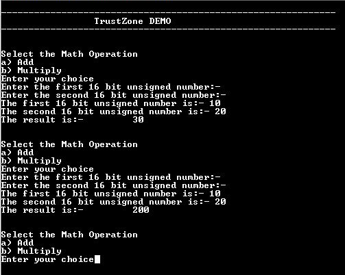

# TrustZone basic demonstration

This example application performs Add and Multiply Math operations in secure mode and I/O operations in non-secure mode.

## Description

This demonstrates TrustZone feature and uses two projects viz., Secure and Non-Secure Project that work together on the same
MCU and offering security isolation between the Trusted and the Non-trusted resources in the device.

- Secure project implements math functions (add and multiply as example)
- Non-secure project uses the math functions exposed by secure project for math operations

## Components Used

- **SERCOM** - Configured as Non-secure mode

## Downloading and building the application

To download or clone this application from Github, go to the [top level of the repository](https://github.com/Microchip-MPLAB-Harmony/csp_apps_sam_l10_l11) and click

Path of the application within the repository is is as shown below:

| Type        | Path                         |
|:-----------:|:----------------------------:|
| Project group | apps/trustZone/trustZone_basic |
|Secure Project|  apps/trustZone/trustZone_basic/Secure/firmware |
|Non-Secure Project|  apps/trustZone/trustZone_basic/NonSecure/firmware |
||||

To build the application, refer to the following table and open the project using its IDE.

| Project Name      | Description                                    |
| :-----------------: | :----------------------------------------------: |
| sam_l11_xpro_Secure.X   sam_l11_xpro_NonSecure.X | Secure and Non-secure MPLABX project for [SAML11 Xplained Pro Evaluation Kit](https://www.microchip.com/DevelopmentTools/ProductDetails/PartNO/DM320205) |
|||

## Setting up the hardware

The following table shows the target hardware for the application projects.

| Project Name| Board|
|:---------|:---------:|
| sam_l11_xpro_Secure.X   sam_l11_xpro_NonSecure.X | [SAML11 Xplained Pro Evaluation Kit](https://www.microchip.com/DevelopmentTools/ProductDetails/PartNO/DM320205) |
|||

### Setting up [SAML11 Xplained Pro Evaluation Kit](https://www.microchip.com/DevelopmentTools/ProductDetails/PartNO/DM320205)

- Connect the Debug USB port on the board to the computer using a micro USB cable

## Running the Application

1. Open the Terminal application (Ex.:Tera term) on the computer
2. Connect to the EDBG Virtual COM port and configure the serial settings as follows:
    - Baud : 115200
    - Data : 8 Bits
    - Parity : None
    - Stop : 1 Bit
    - Flow Control : None
3. Open the project group in the MPLAB X IDE and set the non-secure project as main project
4. Build and program the application
5. Perform the following sequence of operations to do addition of two numbers:
    - Press 'a' to start an addition operation
    - Enter a 16 bit unsigned integer and press 'Enter' on keyboard
    - Enter second 16 bit unsigned number and press 'Enter' on keyboard
    - Observe the result which is addition of first and second 16 bit unsigned number

6. Perform the following sequence of operations to do multiplication of two numbers:
    - Press 'b' to start an addition operation
    - Enter a 16 bit unsigned integer and press 'Enter' on keyboard
    - Enter second 16 bit unsigned number and press 'Enter' on keyboard
    - Observe the result which is multiplication of first and second 16 bit unsigned number

